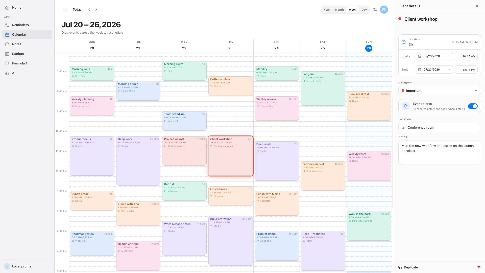
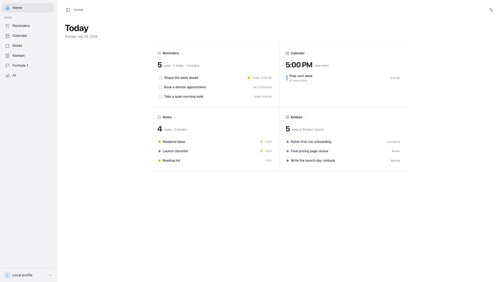
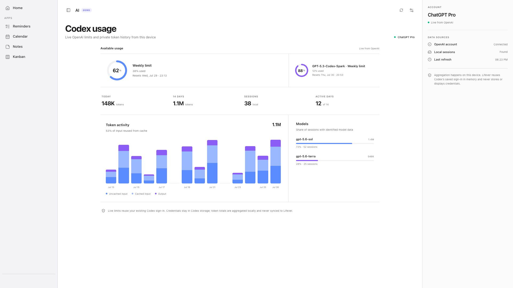
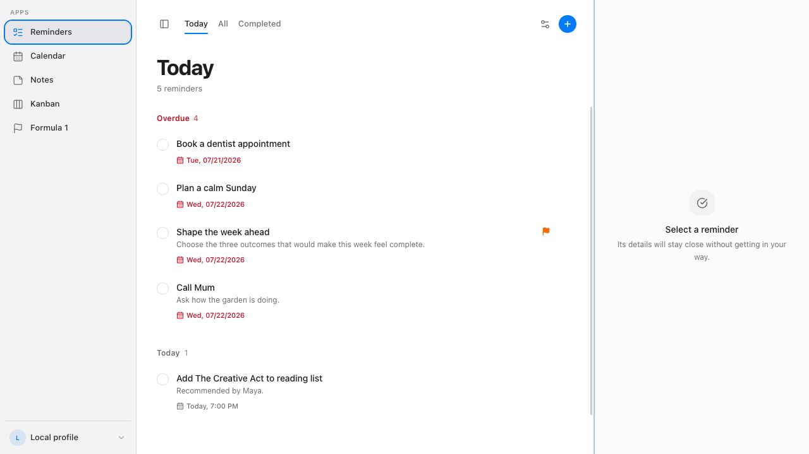
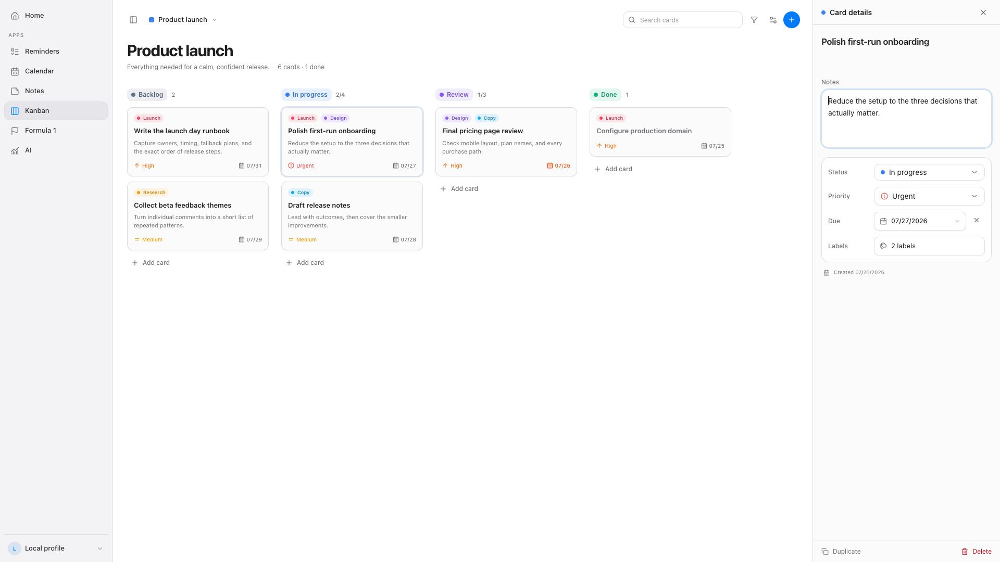
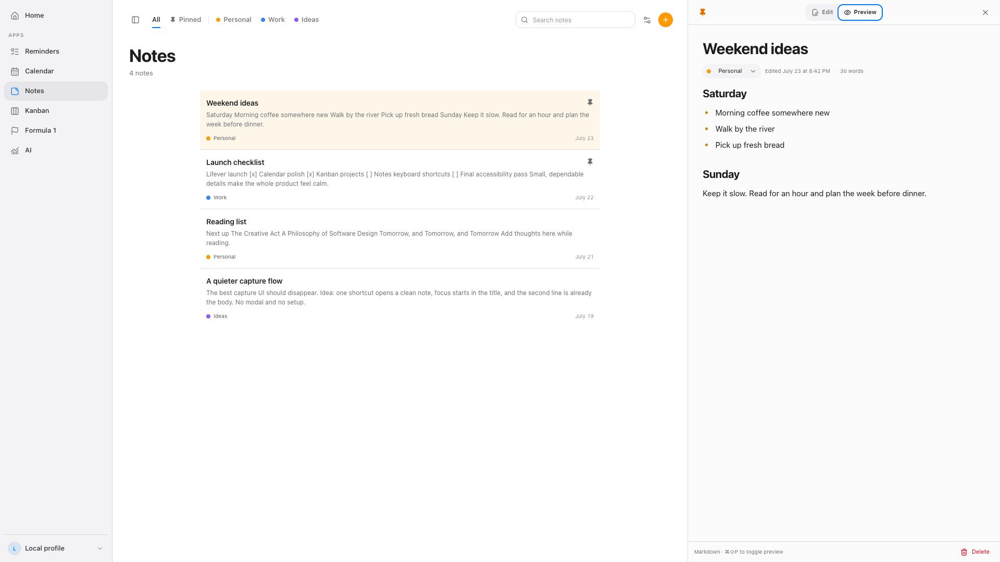
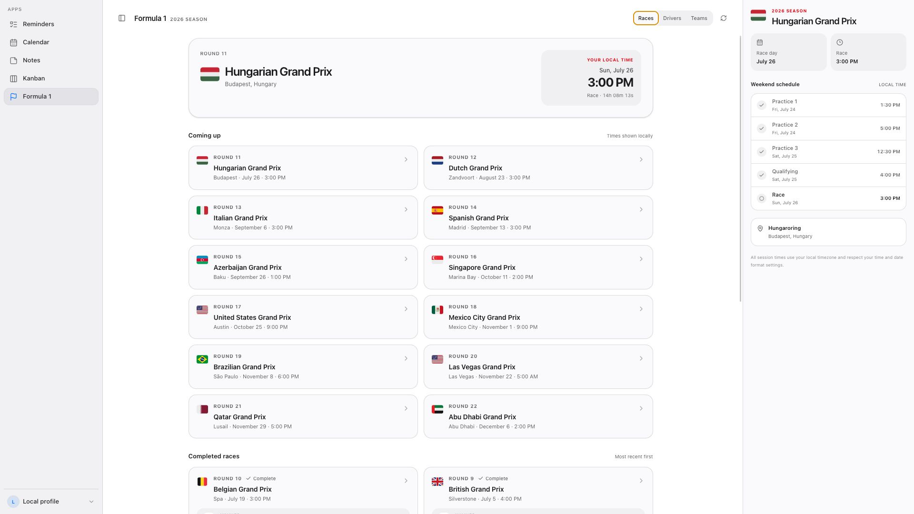

<p align="center">
  
</p>

<h1 align="center">Lifever</h1>

<p align="center">
  A calm, synced home for the everyday parts of life.<br>
  Reminders, calendars, notes, projects, and the things you follow—together on macOS and Windows.
</p>

<p align="center">
  <a href="https://www.lifever.app">Website</a>
  ·
  <a href="https://github.com/badosz0/lifever/releases/latest">Download for macOS</a>
  ·
  <a href="https://github.com/badosz0/lifever/releases/latest/download/Lifever-Windows-x64-setup.exe">Download for Windows</a>
  ·
  <a href="#homebrew">Install with Homebrew</a>
  ·
  <a href="SELF_HOSTING.md">Self-host</a>
</p>



## Everything close at hand

- **Home** — arrangeable summaries of what matters across your enabled apps.
- **Reminders** — natural scheduling, lists, notes, priorities, sounds, and reliable alerts.
- **Calendar** — day, week, month, and year views; multiple calendars; Google sync; drag and resize; categories; and notifications.
- **Notes** — fast search, categories, pinning, Markdown, and focused writing.
- **Kanban** — multiple projects, custom properties, labels, limits, and precise drag and drop.
- **Formula 1** — race weekends, standings, local session times, and live countdowns.
- **AI** — Codex limits, token history, model usage, and RTK savings in one dashboard.

Formula 1 and AI are opt-in. Everything else is ready on first launch.

| Home | AI usage |
| --- | --- |
|  |  |

| Reminders | Kanban |
| --- | --- |
|  |  |

| Notes | Formula 1 |
| --- | --- |
|  |  |

## Built to stay in sync

Lifever requires an account, so your reminders, calendars, notes, projects,
and preferences follow you between devices. Share individual notes, calendars,
or Kanban projects with read-only or editing access; shared work updates live
while everyone is viewing it.

## Install

### macOS

Lifever is universal for Apple silicon and Intel, requires macOS 12 or newer,
and is Developer ID signed and notarized by Apple.

```bash
brew tap badosz0/lifever https://github.com/badosz0/lifever
brew install --cask lifever
```

Update later with:

```bash
brew update
brew upgrade --cask lifever
```

You can also download the latest DMG from
[GitHub Releases](https://github.com/badosz0/lifever/releases/latest).

### Windows

Download the latest
[Windows 10/11 x64 installer](https://github.com/badosz0/lifever/releases/latest/download/Lifever-Windows-x64-setup.exe).
The matching SHA-256 checksum is attached to every release.

## Documentation

- [Building and local development](BUILDING.md)
- [Self-hosting and deployment](SELF_HOSTING.md)
- [Contributing](CONTRIBUTING.md)
